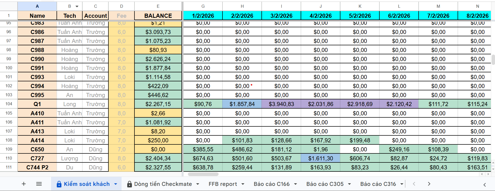

# telegramBotRagGoogleShet

Telegram bot that answers questions from Google Sheets data using a RAG pipeline (LangChain + OpenAI + ChromaDB).





## Features

- Ingest data from Google Sheets or local CSV.
- Store embeddings in ChromaDB.
- Query customer data with natural language.
- Telegram bot interface for end users.
- Full-scan deterministic mode for aggregate/statistical questions.

## Project Structure

- `src/bot.py`: Telegram bot entrypoint.
- `src/ingest_checkmate_data.py`: Ingest data into ChromaDB.
- `src/query_checkmate_data.py`: CLI query tool.
- `src/sheet_assistant.py`: Deterministic assistant for table logic.
- `src/sheet_rag_fullscan.py`: RAG + full-scan routing.
- `config/`: Local configuration files.
- `data/`: Local data and vector stores.

## Prerequisites

- Python 3.10+
- Telegram Bot Token
- OpenAI API key
- Google Service Account credentials (for Google Sheets)
- Docker Desktop (only needed for Docker option)

## Setup Options

### Clone repository

```bash
git clone https://github.com/nminhcuongdev/telegramBotRagGoogleShet.git
cd telegramBotRagGoogleShet
```

### Option 1: Local setup (recommended for development)

1. Create and activate virtual environment

```bash
python -m venv .venv
.venv\Scripts\activate
```

2. Install dependencies

```bash
pip install -r requirements.txt
```

3. Configure environment variables

```bash
copy .env.example .env
```

Then edit `.env`:

- `BOT_TOKEN`: Telegram bot token from BotFather.
- `OPENAI_API_KEY`: OpenAI API key.
- `SHEET_KEY`: Google Sheet key.

4. Add Google credentials

Place your service account file at:

- `config/credentials.json`

5. Run bot

```bash
python src/bot.py
```

### Option 2: Docker setup

1. Configure environment variables

```bash
copy .env.example .env
```

2. Add Google credentials at:

- `config/credentials.json`

3. Build and run with Docker Compose

```bash
docker compose up --build
```

Or run with Docker directly:

```bash
docker build -t telegram-bot-rag .
docker run --rm -it --env-file .env -v %cd%\\data:/app/data -v %cd%\\config:/app/config telegram-bot-rag
```

## Optional Commands (Local mode)

### Ingest data

```bash
python src/ingest_checkmate_data.py
```

### Query in CLI

```bash
python src/query_checkmate_data.py "What is the balance of customer C550?"
```

## Security Notes

- `.env` is ignored by Git.
- `config/credentials.json` is ignored by Git.
- Only `.env.example` is committed as a template.

## License

Add your preferred license file if needed.
